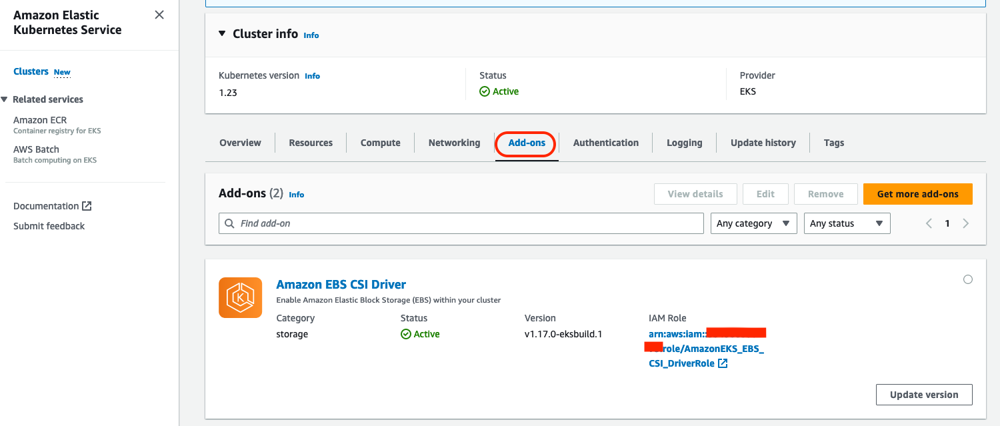

# General reference for EBS CSI driver and some corner cases

## Topology Awareness
By default the PV will get created where the pod is scheduled. If you wish to provision topology aware volumes, read ahead...

### Install EBS CSI driver
Step 1 - Create EBS CSI driver IAM role using [this doc](https://docs.aws.amazon.com/eks/latest/userguide/csi-iam-role.html)
Step 2 - If the CSI driver has not been installed, recommeded to install as a managed add-on from the EKS management console.


### Check 
Create a StorageClass
```
kubectl apply -f https://raw.githubusercontent.com/kubernetes-sigs/aws-ebs-csi-driver/master/examples/kubernetes/storageclass/manifests/storageclass.yaml
```

Example manifest:

*Note*: Replace the attributes in the manifest with ones that are specific to your use case.
```
apiVersion: storage.k8s.io/v1
kind: StorageClass
metadata:
  name: ebs-sc
provisioner: ebs.csi.aws.com
volumeBindingMode: WaitForFirstConsumer
parameters:
  csi.storage.k8s.io/fstype: xfs
  type: io1
  iopsPerGB: "50"
  encrypted: "true"
allowedTopologies:
- matchLabelExpressions:
  - key: topology.ebs.csi.aws.com/zone
    values:
    - us-east-2c
```
*Note*: For topology aware implementation, make sure that you configure the allowedTopologies option. Deleting this option causes the correct Availability Zone to be inferred and the Amazon EBS CSI controller to create a volume where the pod is scheduled.

Create a PV Claim to test
```
kubectl apply -f https://raw.githubusercontent.com/kubernetes-sigs/aws-ebs-csi-driver/master/examples/kubernetes/storageclass/manifests/claim.yaml
```

## Handling Taints
Amazon EKS team recently announced the general availability of advanced configuration feature for managed add-ons. You can now pass in advanced configuration for cluster add-ons, enabling you to customize add-on properties not handled by default settings. Configuration can be applied to add-ons either during cluster creation or at any time after the cluster is created.
Using advanced configuration feature, you can now configure custom tolerations for Amazon EBS CSI driver addon starting from v1.14.0-eksbuild.1. Custom tolerations can be configured through controller.tolerations and node.tolerations. Note, node.tolerateAllTaints will continue to default to true.
To learn more about this feature, check out [this blog](https://aws.amazon.com/blogs/containers/amazon-eks-add-ons-advanced-configuration/)
Check out the Amazon EKS [documentation](https://docs.aws.amazon.com/eks/latest/userguide/managing-add-ons.html)